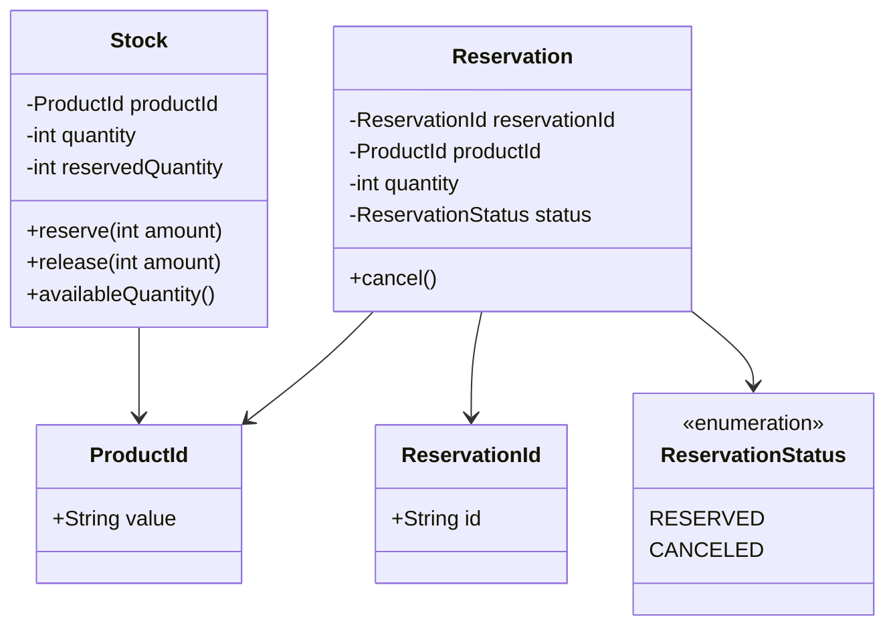
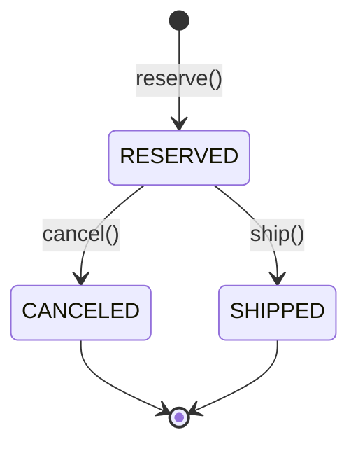
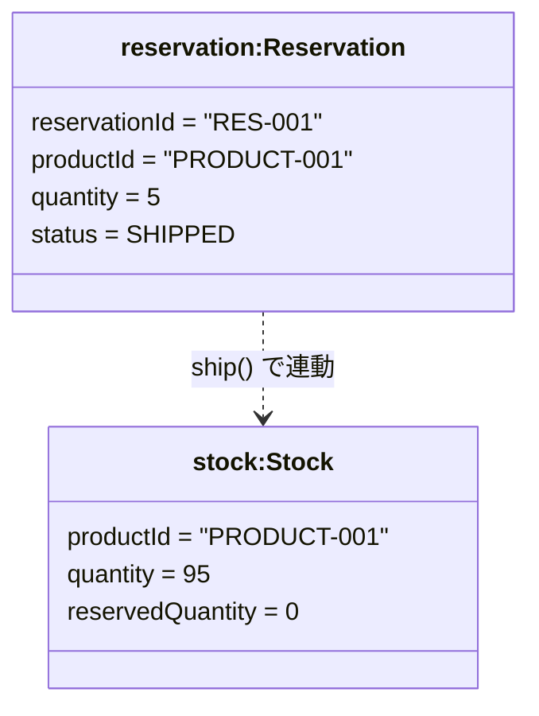
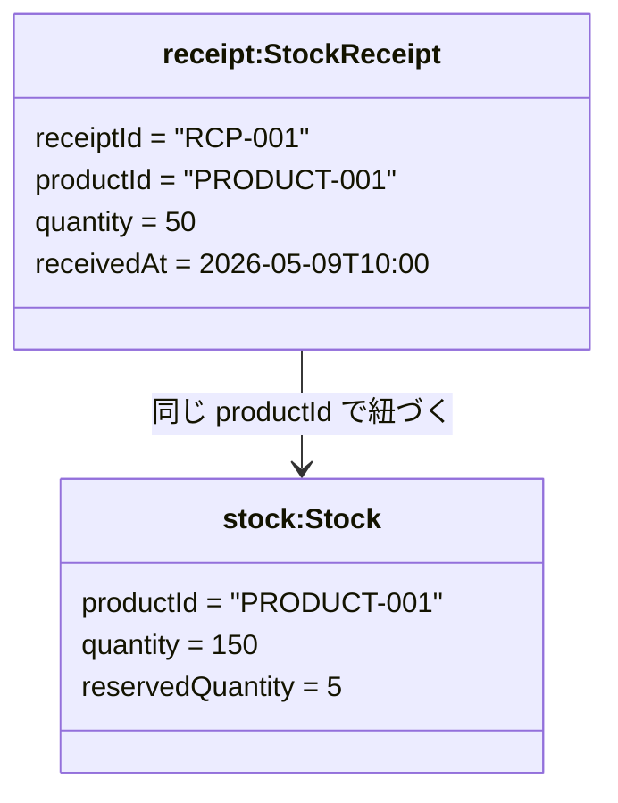
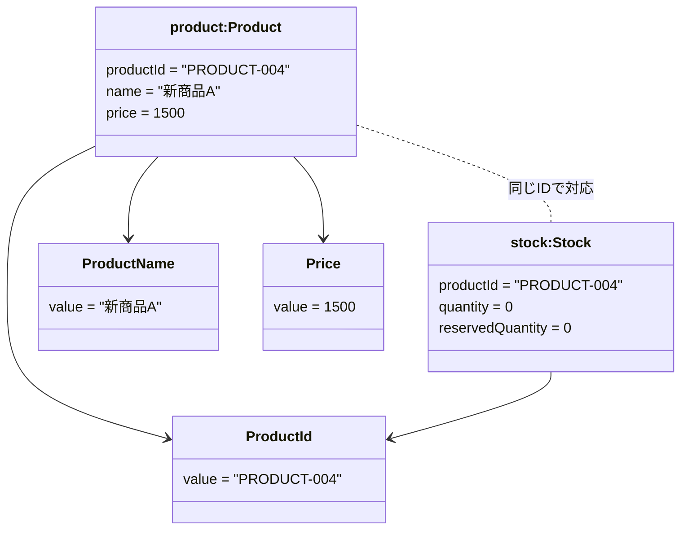
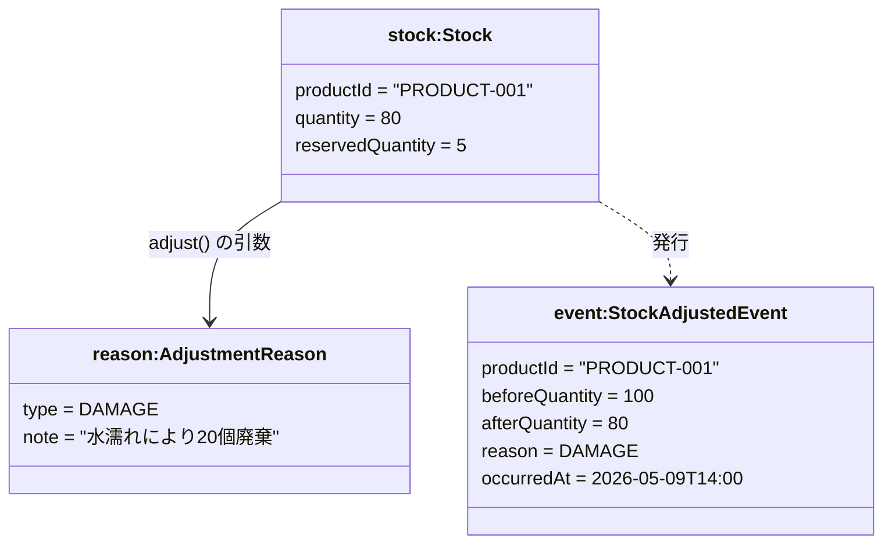
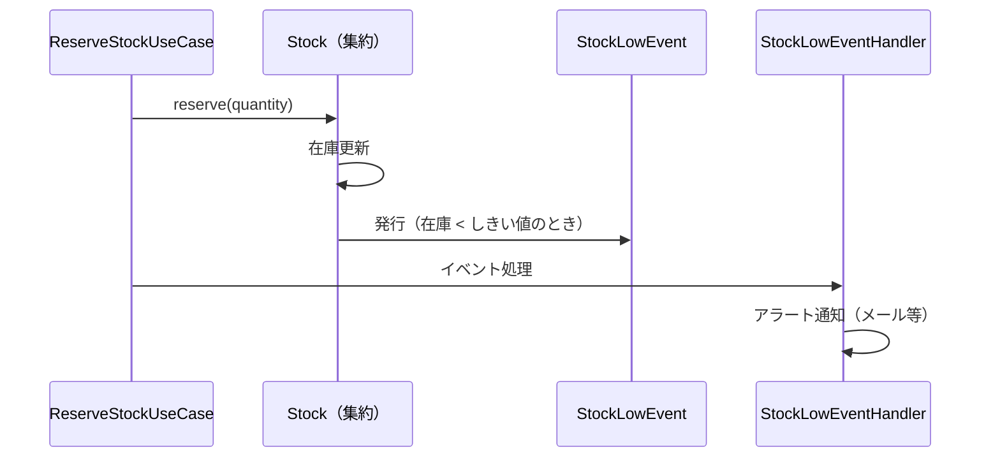
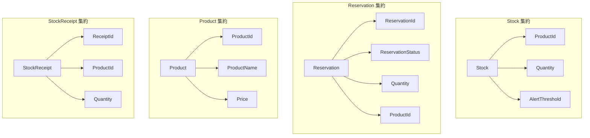

# DDD 学習計画 — 在庫管理システム

## 現在の実装状況

| ユースケース   | 状態        |
| -------------- | ----------- |
| 在庫予約       | ✅ 実装済み |
| 予約キャンセル | ✅ 実装済み |

---

## ドメインモデル全体図（現在）



---

## 追加ユースケース 学習計画

学習効果の高い順にフェーズを分けて設計します。  
各フェーズで習得できるDDDのパターンが異なります。

---

## Phase 1：値オブジェクトの強化

### UC-01 値オブジェクト `Quantity` の導入

**目的：** プリミティブ型を値オブジェクトに置き換える練習

**習得パターン：**

- 値オブジェクトによる不変条件の保護
- ユースケース層での変換タイミング

**現在の問題点：**

- `int quantity` は「数量は1以上」という制約をどこでも守れていない
- `Stock.reserve()` も `Reservation` のコンストラクタも個別にガードする必要がある

**導入後の変化：**

```
UseCase で new Quantity(qty) → 以降すべてのドメインオブジェクトが Quantity を受け取る
```

---

## Phase 2：既存集約の機能拡張

### UC-02 出荷確定（Shipment）

**概要：** 「予約済み」状態の在庫を実際に出荷し、在庫数と予約数を減らす

**ビジネスルール：**

- キャンセル済みの予約は出荷できない
- 出荷確定後は再度キャンセルできない
- 出荷確定により `Stock.quantity` と `Stock.reservedQuantity` の両方が減る

**習得パターン：**

- エンティティの状態遷移（`ReservationStatus` の拡張）
- 集約間の整合性管理

#### 状態遷移図



#### 関与するオブジェクト

**集約：**
| 集約ルート | 識別子 | 変更内容 |
|---|---|---|
| `Stock` | `ProductId` | `ship()` メソッドを追加 |
| `Reservation` | `ReservationId` | `ship()` メソッド追加、`SHIPPED` ステータス追加 |

**値オブジェクト：**
| 名前 | 理由 |
|---|---|
| `Quantity` | 出荷数量の検証 |

#### オブジェクト図（出荷確定後の状態）



---

### UC-03 入荷登録（StockReceipt）

**概要：** 商品が倉庫に届いたとき、在庫数を増やす

**ビジネスルール：**

- 入荷数量は1以上でなければならない
- 入荷の記録（いつ・何が・何個）を残す
- 入荷により `Stock.quantity` が増加する

**習得パターン：**

- 新しい集約の設計（`StockReceipt`）
- 集約同士の関係（`StockReceipt` は `Stock` と別集約）
- `Stock` を変更するだけでよいか、入荷伝票という概念が必要かを議論する

#### 関与するオブジェクト

**集約：**
| 集約ルート | 識別子 | 説明 |
|---|---|---|
| `Stock` | `ProductId` | `restock()` メソッドを追加 |
| `StockReceipt`（新規） | `ReceiptId` | 入荷の記録（履歴として残す） |

**値オブジェクト（新規）：**
| 名前 | 説明 |
|---|---|
| `ReceiptId` | 入荷伝票ID（UUID） |
| `Quantity` | 入荷数量 |

#### オブジェクト図



---

## Phase 3：新しい集約の設計

### UC-04 商品登録（Product）

**概要：** 新しい商品と初期在庫をシステムに登録する

**ビジネスルール：**

- 商品名は空であってはならない
- 初期在庫数は0以上でよい（入荷前の予約登録のため）
- 同じ商品IDは登録できない

**習得パターン：**

- `Product` という新しい集約の設計
- `Stock` の生成タイミングを考える（商品登録時に一緒に作るか？）
- 集約のルートと、集約の境界の決め方

#### 関与するオブジェクト

**集約（新規）：**
| 集約ルート | 識別子 | 説明 |
|---|---|---|
| `Product`（新規） | `ProductId` | 商品の情報を管理 |
| `Stock` | `ProductId` | 商品登録と同時に生成される |

**値オブジェクト（新規）：**
| 名前 | 説明 | 不変条件 |
|---|---|---|
| `ProductName` | 商品名 | 空文字列不可、50文字以内 |
| `Price` | 価格 | 0以上の整数 |

#### オブジェクト図



---

### UC-05 在庫調整（StockAdjustment）

**概要：** 棚卸しや破損等により、実在庫数を手動で修正する

**ビジネスルール：**

- 調整後の在庫数は0以上でなければならない
- 調整後の在庫数が予約済み数量を下回ってはならない
- 調整理由を必ず記録する（監査目的）

**習得パターン：**

- `AdjustmentReason` という値オブジェクト（列挙型 + 補足テキスト）
- ドメインイベント入門（`StockAdjustedEvent`）
- 「イベントとして記録に残す」vs「エンティティとして管理する」の設計判断

#### 関与するオブジェクト

**集約：**
| 集約ルート | 識別子 | 変更内容 |
|---|---|---|
| `Stock` | `ProductId` | `adjust()` メソッドを追加 |

**値オブジェクト（新規）：**
| 名前 | 説明 |
|---|---|
| `AdjustmentReason` | 調整理由（`STOCKTAKING` / `DAMAGE` / `CORRECTION` + 補足テキスト） |
| `Quantity` | 調整後の数量 |

**ドメインイベント（新規）：**
| 名前 | 説明 |
|---|---|
| `StockAdjustedEvent` | 在庫調整が行われたことを表すイベント |

#### オブジェクト図



---

## Phase 4：ドメインイベント

### UC-06 在庫不足アラート（LowStockAlert）

**概要：** 在庫の利用可能数量がしきい値を下回ったとき、通知を発する

**習得パターン：**

- ドメインイベントによる疎結合設計
- イベントハンドラーのアプリケーション層への配置
- 「集約内でイベントを発行し、アプリ層で処理する」流れ

#### 関与するオブジェクト

**集約：**
| 集約ルート | 変更内容 |
|---|---|
| `Stock` | `reserve()` の後にしきい値チェックしてイベント発行 |

**値オブジェクト（新規）：**
| 名前 | 説明 |
|---|---|
| `AlertThreshold` | アラートを発するしきい値（0以上の整数） |

**ドメインイベント（新規）：**
| 名前 | 説明 |
|---|---|
| `StockLowEvent` | 在庫不足を表すイベント |

#### イベントの流れ



---

## ユースケース × DDD要素 対応表

| ユースケース       | 値オブジェクト                | 集約                       | ドメインサービス           | ドメインイベント         |
| ------------------ | ----------------------------- | -------------------------- | -------------------------- | ------------------------ |
| UC-01 Quantity導入 | `Quantity`                    | —                          | —                          | —                        |
| UC-02 出荷確定     | `Quantity`                    | `Stock` `Reservation`      | `ReservationDomainService` | —                        |
| UC-03 入荷登録     | `ReceiptId` `Quantity`        | `Stock` `StockReceipt`(新) | —                          | —                        |
| UC-04 商品登録     | `ProductName` `Price`         | `Product`(新) `Stock`      | —                          | —                        |
| UC-05 在庫調整     | `AdjustmentReason` `Quantity` | `Stock`                    | —                          | `StockAdjustedEvent`(新) |
| UC-06 在庫アラート | `AlertThreshold`              | `Stock`                    | —                          | `StockLowEvent`(新)      |

---

## TDD での進め方

### 基本サイクル

```
🔴 Red    → まずテストを書く（コンパイルエラーになってよい）
🟢 Green  → テストが通る最小限の実装を書く
🔵 Refactor → コードを整理する（テストは通したまま）
```

### DDDとTDDの相性

ドメイン層（値オブジェクト・集約）はDBや外部依存がないため、**ユニットテストが最も書きやすい場所**です。  
「テストを先に書く」ことで、ドメインの振る舞いを先に言語化できます。

### テストの種類と配置

```
src/test/java/
  └─ domain/           ← ユニットテスト（DBなし・Springなし）★ メインの練習場所
       model/
         stock/
           StockTest.java
           QuantityTest.java
         reservation/
           ReservationTest.java
  └─ application/      ← ユニットテスト（Repositoryをモック化）
       usecase/
         ReserveStockUseCaseTest.java
  └─ adapter/          ← 統合テスト（Spring起動）
       web/
         StockControllerTest.java
```

### 各UCのTDD進め方

---

#### UC-01 `Quantity` のTDDフロー

**🔴 Step 1: まずテストを書く**

```java
// QuantityTest.java
class QuantityTest {

    @Test
    void 正の数量を生成できる() {
        Quantity qty = new Quantity(5);
        assertThat(qty.value()).isEqualTo(5);
    }

    @Test
    void ゼロはNG() {
        assertThatThrownBy(() -> new Quantity(0))
            .isInstanceOf(IllegalArgumentException.class);
    }

    @Test
    void 負の数はNG() {
        assertThatThrownBy(() -> new Quantity(-1))
            .isInstanceOf(IllegalArgumentException.class);
    }

    @Test
    void 数量を加算できる() {
        Quantity result = new Quantity(3).add(new Quantity(2));
        assertThat(result.value()).isEqualTo(5);
    }

    @Test
    void 不足分を減算するとエラー() {
        assertThatThrownBy(() -> new Quantity(3).subtract(new Quantity(5)))
            .isInstanceOf(IllegalStateException.class);
    }
}
```

**🟢 Step 2: テストが通る実装を書く**  
→ `Quantity` レコードを実装する

**🔵 Step 3: リファクタリング**  
→ `Stock.reserve()` / `Reservation` を `Quantity` に置き換える

---

#### UC-02 出荷確定のTDDフロー

**🔴 Step 1: 状態遷移のテストを先に書く**

```java
// ReservationTest.java
class ReservationTest {

    @Test
    void 予約済み状態から出荷確定できる() {
        Reservation reservation = /* RESERVED状態のオブジェクト */;
        reservation.ship();
        assertThat(reservation.getStatus()).isEqualTo(ReservationStatus.SHIPPED);
    }

    @Test
    void キャンセル済みは出荷できない() {
        Reservation reservation = /* CANCELED状態のオブジェクト */;
        assertThatThrownBy(() -> reservation.ship())
            .isInstanceOf(IllegalStateException.class);
    }

    @Test
    void 出荷済みはキャンセルできない() {
        Reservation reservation = /* SHIPPED状態のオブジェクト */;
        assertThatThrownBy(() -> reservation.cancel())
            .isInstanceOf(IllegalStateException.class);
    }
}

// StockTest.java
class StockTest {

    @Test
    void 出荷確定で在庫数と予約数が減る() {
        Stock stock = new Stock(new ProductId("P-001"), 100, 5);
        stock.ship(new Quantity(5));
        assertThat(stock.getQuantity()).isEqualTo(95);
        assertThat(stock.getReservedQuantity()).isEqualTo(0);
    }
}
```

**🟢 Step 2: `SHIPPED` ステータス → `Reservation.ship()` → `Stock.ship()` の順で実装**

---

#### UC-03 入荷登録のTDDフロー

**🔴 Step 1: `Stock.restock()` のテストを先に書く**

```java
// StockTest.java
@Test
void 入荷で在庫数が増える() {
    Stock stock = new Stock(new ProductId("P-001"), 100, 5);
    stock.restock(new Quantity(50));
    assertThat(stock.getQuantity()).isEqualTo(150);
}

// StockReceiptTest.java
@Test
void 入荷伝票を生成できる() {
    StockReceipt receipt = StockReceipt.create(new ProductId("P-001"), new Quantity(50));
    assertThat(receipt.getProductId().value()).isEqualTo("P-001");
    assertThat(receipt.getQuantity().value()).isEqualTo(50);
}
```

---

#### UC-05 在庫調整のTDDフロー（ドメインイベント入門）

**🔴 Step 1: イベントが発行されることをテストする**

```java
// StockTest.java
@Test
void 在庫調整でイベントが発行される() {
    Stock stock = new Stock(new ProductId("P-001"), 100, 5);
    AdjustmentReason reason = new AdjustmentReason(AdjustmentType.DAMAGE, "水濡れ");

    stock.adjust(new Quantity(80), reason);

    List<DomainEvent> events = stock.getDomainEvents();
    assertThat(events).hasSize(1);
    assertThat(events.get(0)).isInstanceOf(StockAdjustedEvent.class);

    StockAdjustedEvent event = (StockAdjustedEvent) events.get(0);
    assertThat(event.afterQuantity().value()).isEqualTo(80);
}
```

---

## 実装する順番（推奨）

```
Step 1: UC-01  Quantity値オブジェクトの作成・既存コードへの適用
           └─ TDD: QuantityTest → Quantity実装 → Stock/Reservation修正
           └─ 変更ファイル: Stock, Reservation, ReservationDomainService, UseCases

Step 2: UC-02  出荷確定
           └─ TDD: ReservationTest(ship) → StockTest(ship) → UseCase実装
           └─ 変更ファイル: ReservationStatus(+SHIPPED), Reservation(+ship), Stock(+ship)
              追加ファイル: ShipStockUseCase

Step 3: UC-03  入荷登録
           └─ TDD: StockTest(restock) → StockReceiptTest → UseCase実装
           └─ 追加ファイル: StockReceipt, ReceiptId, StockReceiptRepository, RestockUseCase
              変更ファイル: Stock(+restock)

Step 4: UC-04  商品登録
           └─ TDD: ProductNameTest(バリデーション) → ProductTest → UseCase実装
           └─ 追加ファイル: Product, ProductName, Price, ProductRepository, RegisterProductUseCase

Step 5: UC-05  在庫調整
           └─ TDD: StockTest(adjust+イベント) → AdjustmentReason → UseCase実装
           └─ 追加ファイル: AdjustmentReason, StockAdjustedEvent
              変更ファイル: Stock(+adjust)

Step 6: UC-06  在庫不足アラート
           └─ TDD: StockTest(reserve後イベント確認) → Handler実装
           └─ 追加ファイル: AlertThreshold, StockLowEvent, StockLowEventHandler
              変更ファイル: Stock(reserve内にイベント発行)
```

---

## 集約の境界まとめ（最終形）



> 集約間の参照は **IDのみ** で行う（`ProductId` など）。  
> 直接オブジェクト参照をまたがない。
